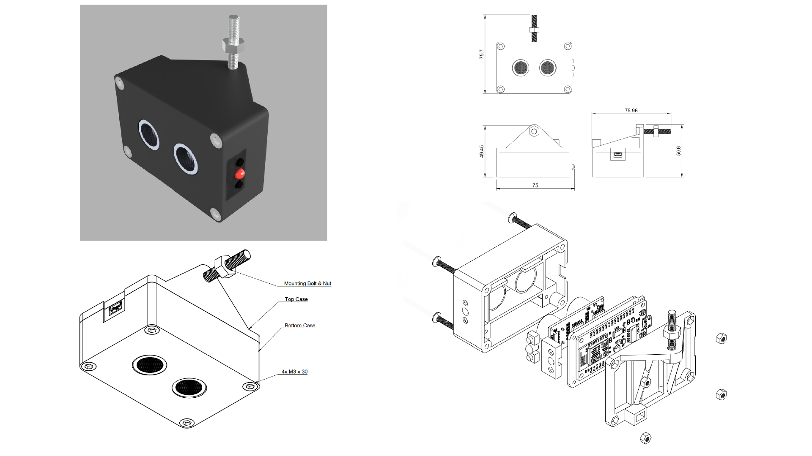

 
# UltraWaveMeter 🌊📏

**UltraWaveMeter** is an Arduino-based ultrasonic measurement system designed to measure distances and detect waves using the **HC-SR04** ultrasonic sensor. It is built on the **ESP8266** microcontroller and supports real-time data logging, temperature-compensated calculations, and serial interface control.

<figure>
    
    <figcaption>UltraWaveMeter - Final Assembled Module</figcaption>
</figure>


## About the Project  

This project was developed in collaboration with the [**Department of Civil Engineering at the University of Aveiro**](https://www.ua.pt/pt/decivil/). It was designed as a measurement device to analyze wave behavior in an artificial canal. The collected wave data was used to study the effects of different materials and techniques for **wave energy dissipation**, specifically in structures like breakwaters and seawalls—such as the **Paredão de Aveiro**.  

The module was custom-built to be attached to the **artificial canal** used for the experiment. Waves were artificially generated using a mechanical system, allowing researchers to test various **frequencies and amplitudes**.  

Upon completion, the module was delivered to a faculty professor along with an **instruction manual**, ensuring that it could be reused and easily adapted for future experiments.  

A prototype featured Wi-Fi connectivity for remote data transmission and control. However, due to time constraints and network configuration complexities, this feature was omitted from the final version.

<figure>
    
    <figcaption>UltraWaveMeter measuring waves in an artificial canal</figcaption>
</figure>


[Video example of the artificial waves](Images/Video.mp4)


## Features
* **Accurate Distance Measurement:** Uses an **HC-SR04** ultrasonic sensor.
* **ESP8266 Microcontroller:** For reliable data processing.
* **Temperature Compensation:** Ensures precise readings.
* **Real-time Serial Monitoring and Logging:** For immediate data analysis.
* **Adjustable Sampling Rate:** Provides flexibility in measurement frequency.
* **Physical Buttons & Remote Trigger:** Offers multiple control options.
* **Serial Commands:** Enables remote operation.
* **Durable Enclosure:** 3D printed using PETG for enhanced durability.

## Components
| Quantity | Component        | Model         |
|----------|-----------------|--------------|
| 1        | Microcontroller  | ESP8266      |
| 1        | Ultrasonic Sensor | HC-SR04     |
| 1        | Red LED         | Generic      |
| 1        | Resistor (330Ω) | Generic      |
| 3        | Push Button     | Generic      |
| 1        | USB Cable (Micro-USB)* | Generic |

###### *depends on the dev board used
## Wiring Diagram
The setup connects the **HC-SR04** sensor to the **ESP8266**, along with buttons for user input and an LED indicator. Ensure correct wiring to prevent malfunctions.   
BTN2 is a remote trigger button connected via a JST plug.

**Pin Assignments:**

| Component         | Pin  | GPIO |
|-------------------|------|------|
| BTN1              | D3   | GPIO 0|
| BTN2              | SD3  | GPIO 10|
| LED               | D0   | GPIO 16|
| RST Button        | RST  |    |
| HC-SR04 Trigger   | D6   | GPIO 13|
| HC-SR04 Echo      | D7   | GPIO 15|


<figure>
    
    <figcaption>UltraWaveMeter wiring diagram </figcaption>
</figure>

<figure>
    
    <figcaption>UltraWaveMeter internal wiring and assembly </figcaption>
</figure>

## 3D Model and assembly 

The 3D model consists of three main parts. The shell is made up of two sections that screw together, forming a water-resistant enclosure for the electrical components. The ultrasonic sensor is securely held in place at the bottom, fitting snugly within the housing and pressed together with a tray that houses the ESP8266 dev board. The design prioritizes ease of assembly and maintenance, allowing for quick repairs in case of failure.

<figure>
    
    <figcaption>3D Model, Renders, and Technical Drawings of the UltraWaveMeter Enclosure </figcaption>
</figure>

The top and bottom enclosures are screwed together with an insulating material (silicone glue or a rubber gasket) to prevent water ingress, with additional silicone glue applied around the ultrasonic module tubes for further sealing.


### Remote Trigger Button (BTN2)

 - BTN2 uses a JST connector, glued and insulated to prevent water ingression, and a 3-meter cable for remote operation.  
  
<figure>
    
    <figcaption>Waterproof Remote Trigger Button (BTN2) with JST Connector </figcaption>
</figure>

## Usage Instructions
1.  **Position:** Place the module above the measurement area.
2.  **Connect:** Connect the USB cable to a computer.
3.  **Open Serial Monitor:** Set the baud rate to 9600.
4.  **Temperature Input:** Enter the ambient temperature when prompted.
5.  **Start Measurement:**
    * Press Button 1, Button 2, or enter 'S' in the serial monitor.
    * Default sampling interval is 40ms.
    * To change, enter 'N' and specify a value >40ms.
6.  **Stop Measurement:**
    * Press Button 1, Button 2, or enter 'S'.
7.  **Save Data:**
    * Copy the serial monitor output for analysis.
8.  **Reset:**
    * Enter 'R' or press the reset button.

## Arduino Code / Sketch

### Deprecated Code
The version of the code in **Original_Portuguese** is now deprecated and is no longer actively maintained. Please use the version in **Translated_English** for the most up-to-date version of the software.

- **[Original Version (Portuguese)](Arduino_Sketch/Original_Portuguese/UltraWaveMeter/UltraWaveMeter.ino)** - Deprecated
- **[Updated Version (English)](Arduino_Sketch/Translated_English/UltraWaveMeter/UltraWaveMeter.ino)** - Recommended

## How the Sensor Works
The **HC-SR04** ultrasonic sensor emits a **40 kHz** sound wave that reflects off objects. The sensor calculates the time taken for the wave to return and determines the distance using the formula:

$$
\text{Distance (cm)} = \frac{\text{Speed of Sound (cm/μs)} \times \text{Echo Signal Duration (μs)}}{2}
$$  

With temperature compensation:  

$$
\text{Distance} = 0.034 \times \frac{\text{Echo}}{2} \times \frac{1 + T}{273.15} \times 60.368
$$  


## Example Output
<details>
  <summary>Example</summary>

```
PROGRAM STARTING

Enter ambient temperature: 23
23
Temperature saved
===== Program Initialized =====

Baseline distance: 124,5 cm 
Baseline distance: 125,1 cm 

Average: 124,8 cm 

Version: V5.0

Ultrasonic Wave Measurement System
To start measurements, press Button 1, Button 2, or enter 'S' in serial console.
To stop, press Button 1, Button 2, or enter 'S' in serial console.
To use a custom sample interval (default = 40ms), enter 'N'.
To RESET the system, enter 'R'.
****************************

Waiting to start -> Press Button 1 or Button 2 or enter 'S' OR 'N'
S

********** READING NUMBER: 1 **********
Baseline distance: 124,8 cm 
Baseline distance: 125,2 cm 
Baseline distance: 124,9 cm 
Baseline distance: 125,0 cm 
Baseline distance: 125,3 cm 

Baseline distance: Average = 125,04 cm 

Sample interval: 40ms 

DISTANCE (cm) || TIME (ms)

125,04 40
125,05 80
125,12 120
125,08 160
125,11 200
124,98 240
120,34 280
115,22 320
110,15 360
105,47 400
100,32 440
95,78 480
90,23 520
85,69 560
90,14 600
95,33 640
100,21 680
105,67 720
110,45 760
115,22 800
120,11 840
124,76 880
124,88 920
124,93 960
125,02 1000
S

Waiting to start -> Press Button 1 or Button 2 or enter 'S' OR 'N'
N

MODE 2

Enter desired sample interval in ms (minimum 40ms): 100
(...)
```

</details>

The data was then copied into Excel, where graphs were generated, and average, minimum, and maximum measurements were calculated. Relevant equations were applied to analyze the wave behavior and energy dissipation.

<figure>
    
    <figcaption>Analyzing UltraWaveMeter Data in Excel - Wave Behavior Graphs </figcaption>
</figure>


## Software
The system is programmed using **Arduino IDE** with the **NewPing** library by Tim Eckel. The library simplifies sensor interactions and improves accuracy.

### Useful Links
- [Arduino NewPing Library](https://www.arduino.cc/reference/en/libraries/newping/)
- [NewPing Documentation](https://bitbucket.org/teckel12/arduino-new-ping/wiki/Home)

------
## 📜 License
Developed by **João Fernandes**  

This project is licensed under the Creative Commons Attribution-NonCommercial 4.0 International License (CC BY-NC 4.0)

UltraWaveMeter © 2022-2025 by João Fernandes is licensed under Creative Commons Attribution-NonCommercial 4.0 International

To view a copy of this license, visit: http://creativecommons.org/licenses/by-nc/4.0/

or send a letter to:

Creative Commons
PO Box 1866  
Mountain View,    
CA 94042  
USA  

In summary (not a substitute for the full license):

 - You are free to share and adapt the material for non-commercial purposes
 - You must give appropriate credit and indicate if changes were made
 - You may not use the material for commercial purposes without specific permission
